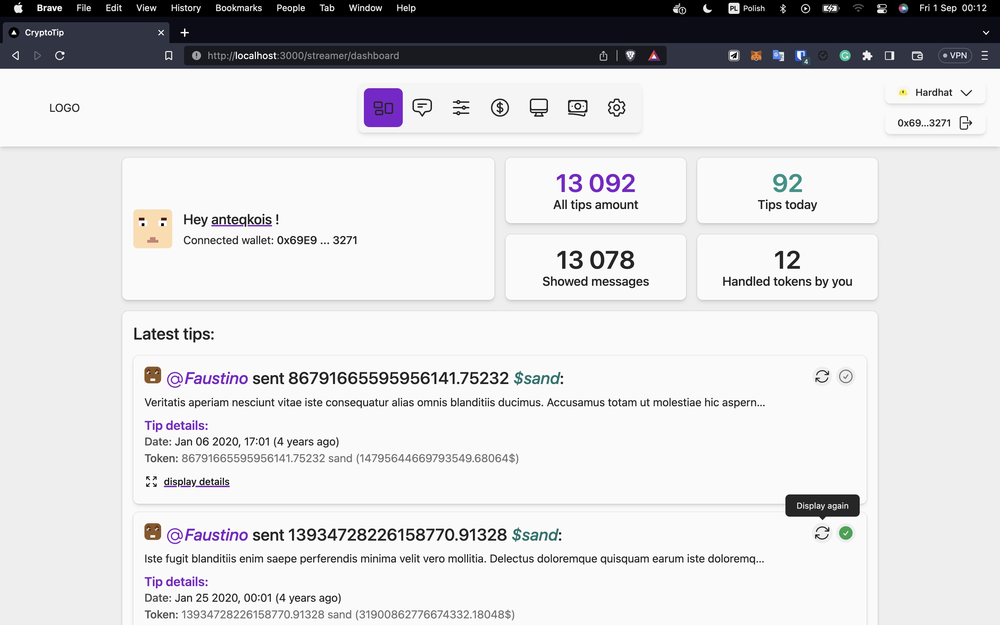
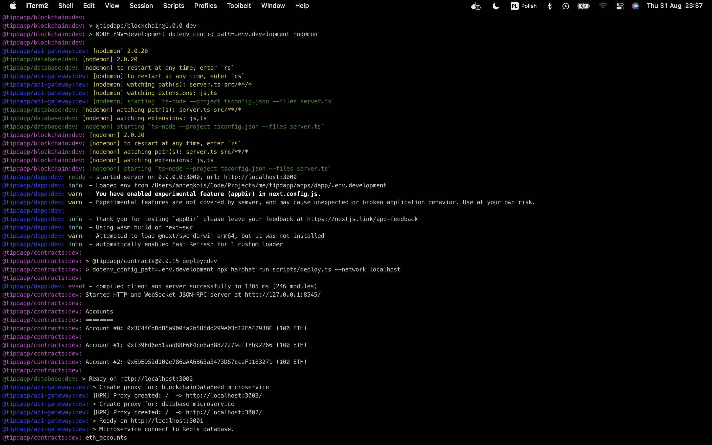
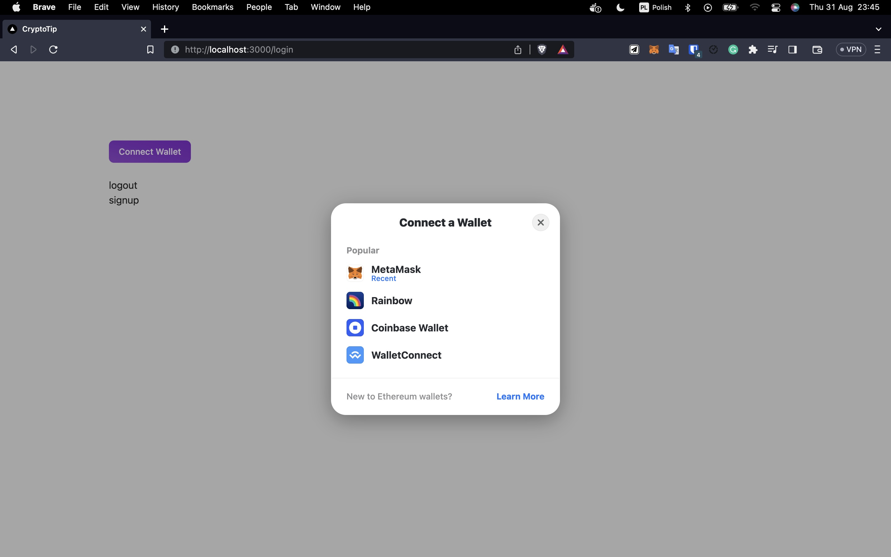
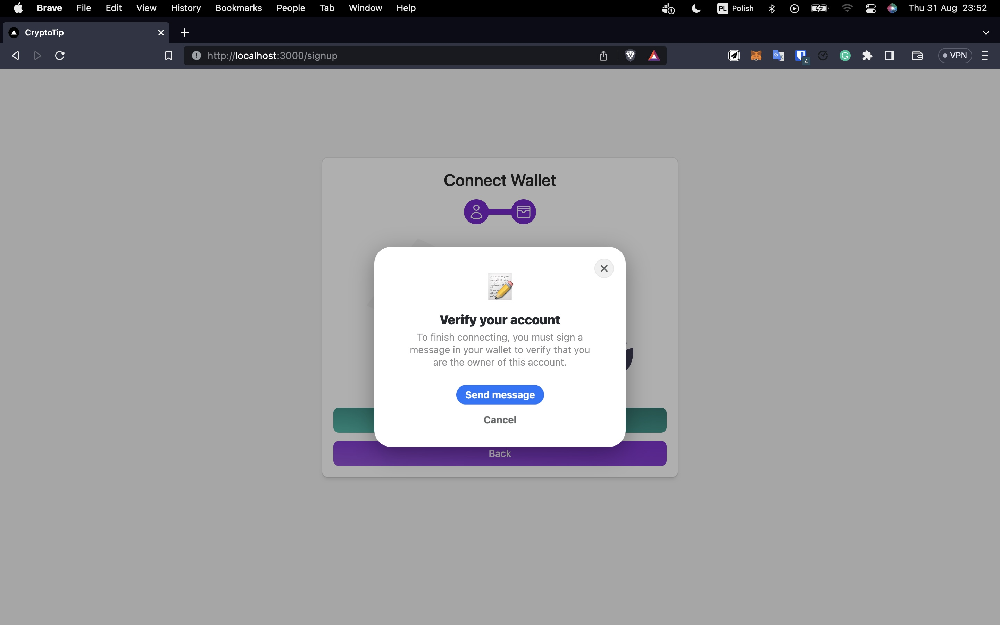
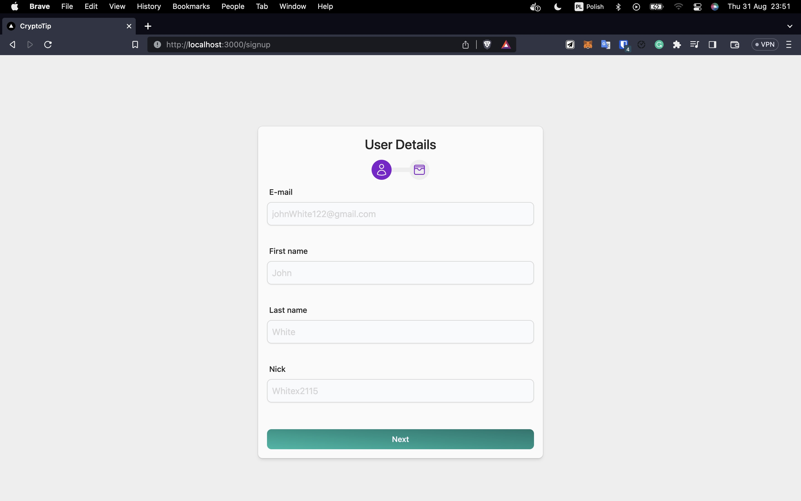
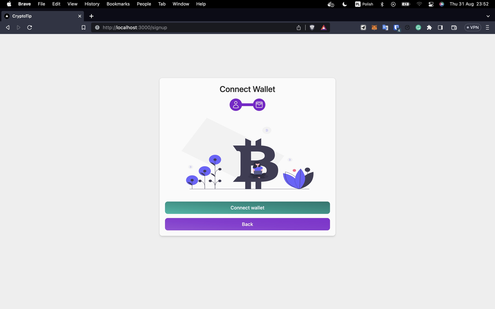
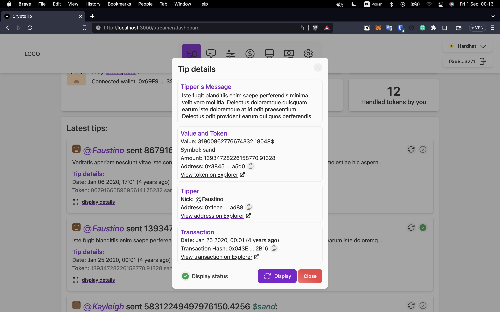

# TippDAPP - A Decentralized Tipping and Utility Token Platform

## Table of Contents

- [Introduction](#introduction)
- [Architecture](#architecture)
- [Key Features](#key-features)
- [Technologies](#technologies)
- [Images and Video](#images-and-video)
<!-- - [License](#license) -->

## Introduction

TippDAPP is a powerful web application built on the Ethereum blockchain and web3 technology, designed to empower content creators, influencers, charities, and similar individuals/organizations. It enables these users to receive tips from their fans and donors while giving back personalized utility tokens in return. These utility tokens can be utilized as assets in the user's store, granting access to exclusive events, and much more.

## Key Features

TippDAPP offers a range of key features:

- **Decentralized Tipping:** Seamlessly interact with the Ethereum blockchain using web3 technology to enable decentralized tipping.

- **Utility Token Issuance:** Facilitate the issuance of personalized utility tokens to give back to your supporters.

- **Microservices Architecture:** The project follows a microservices architecture, orchestrated through a central API Gateway, ensuring scalability and maintainability.

- **Highly Tested Smart Contracts:** Smart contracts adhere to the Diamond standard (EIP-2535) with extensive test coverage to ensure their reliability.

- **Modular Codebase:** Organize the codebase into packages for modularity and ease of development.

- **CLI Scripts:** Simplify project management with the help of CLI scripts, written in zx and bash.

- **Secure Web3 Authentication:** Implement secure authentication using web3 technology.

## Architecture

TippDAPP's architecture is designed for scalability, maintainability, and reliability:

- **Monorepo:** TippDAPP is organized as a monorepo, efficiently managed with Turborepo.

- **Microservices:** The project follows a microservices architecture, orchestrated through a central API Gateway.

- **Smart Contracts:** Smart contracts adhere to the Diamond standard (EIP-2535) with high test coverage to ensure their reliability.

- **Package-Based Repository:** The codebase is organized into packages for modularity and ease of development.

- **CLI Scripts:** Simplify project management with the help of CLI scripts, written in zx and bash.

- **Web3 Authentication:** Implement secure authentication using web3 technology.

## Technologies

<!--  -->

 
 

- **Frontend:** Developed with ReactJS (NextJS), utilizing TypeScript and Redux for state management.

- **Backend:** Powered by NodeJS (ExpressJS) for server-side logic.

- **Database:** PostgreSQL with PrismaORM for efficient data management.

- **Data Store:** Utilizes Redis for caching and data management.

- **Containerization:** Docker and Docker Compose enable easy deployment and scaling.

- **Message Queue:** RabbitMQ is employed for asynchronous communication.

- **UI Design:** The UI is crafted with Tailwind CSS for a polished user experience.

- **Blockchain Interaction:** EthersJS and Wagmi are used for interacting with the Ethereum blockchain.

- **Smart Contracts:** Solidity, along with Hardhat for development and testing.

- **Project Management:** Turborepo simplifies the management of a monorepo codebase.

## Images and Video

### Overview Video

<!--  -->

### Screenshots

<!--

## License

TippDAPP is licensed under the [MIT License](LICENSE.md). Feel free to fork the project and use it according to the terms of the license. -->
